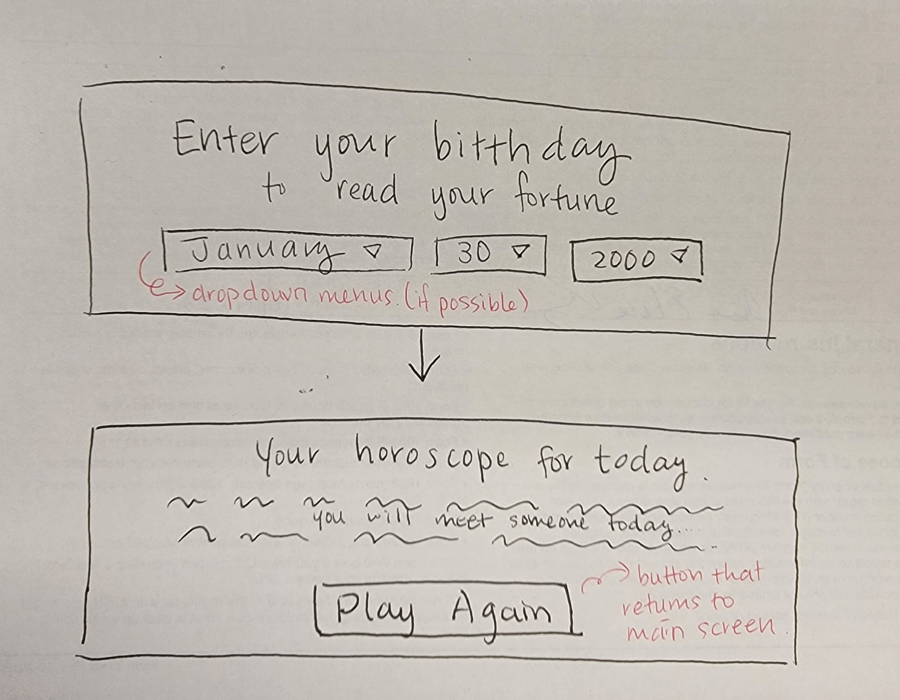
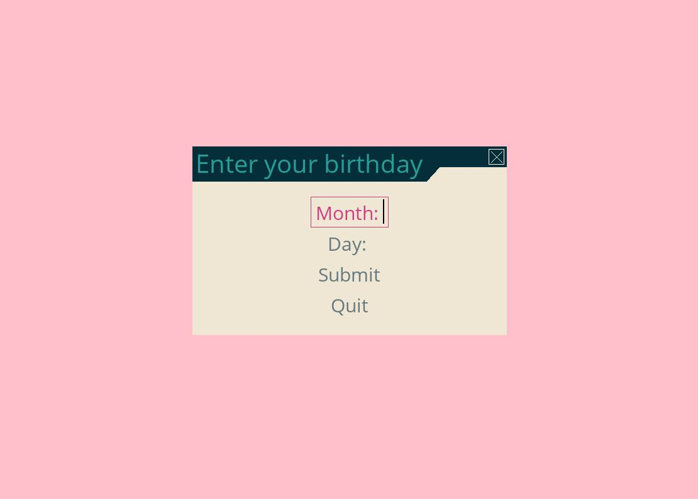
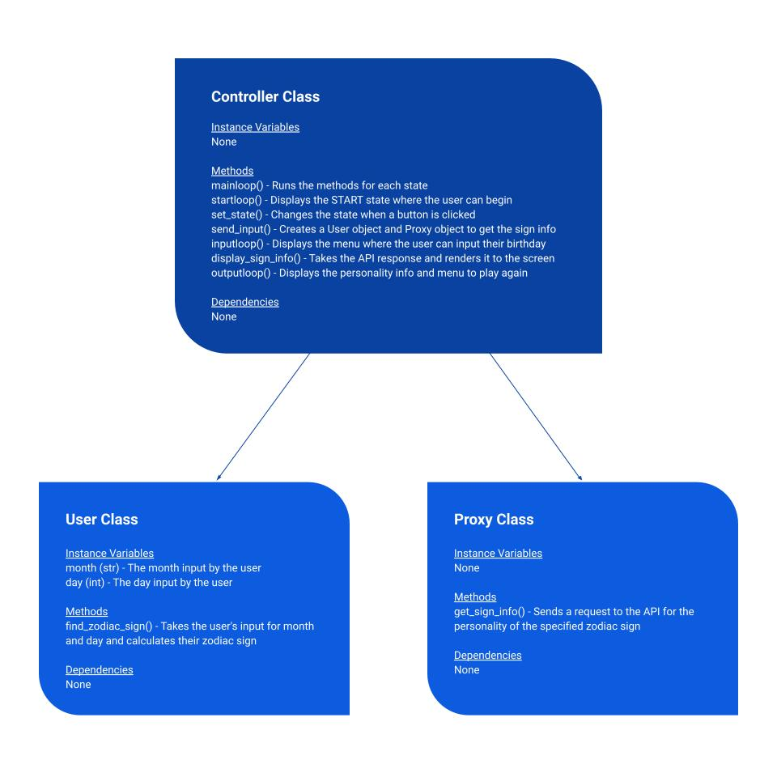

# Zodiac Personality Profile
## CS110 Final Project - Fall 2023

## Team Members

Katarzyna Mazur, Anne Peng

## Project Description

This program shows the user a personality profile based on their birthdate and zodiac sign. 

## GUI Design

### Initial Design

### Final Design

## Program Design

### Features
1. Some input method for the user's birthday
2. Calculation to determine the user's zodiac sign
3. Requests to a horoscope API
4. Displays the user's personality profile
5. Play again button

### Classes
1. User class - Determines the user's zodiac sign based on the date that was entered
2. Proxy class - Sends and receives the API request for the zodiac sign personality
3. Controller class - Displays the screen to the user, manages the states of the program, takes the user's input and sends it to the User class, receives the user's zodiac sign from the User class, sends the user's zodiac sign to the Proxy class, receives the user's personality info from the Proxy class, displays the personality info to the user

## ATP

### Test Case 1: Starting the Input Menu

**Test Description:** Verify that the program starts and the user is taken to a new menu.

**Test Steps:**
1. Start the program.
2. Click the Play button.
3. Verify that a new menu appears.

**Expected Outcome:** When the user clicks "Play", a new menu that asks for their birthday should appear.

### Test Case 2: Responding to Input

**Test Description:** Ensure that the user can input their birthday.

**Test Steps:**
1. Start the program.
2. Click the Play button.
3. Click the Month field.
4. Type the name of a month.
5. Click the Day field.
6. Type a number between 1 and 31 (inclusive).
7. Confirm that what is typed is what appears on screen.

**Expected Outcome:** When an aphanumeric character is pressed on the keyboard, it should appear on screen.

### Test Case 3: Checking the Zodiac Sign

**Test Description:** Confirm that the program displays the correct zodiac sign based on the month and day.

**Test Steps:**
1. Start the program.
2. Click the Play button.
3. Click the Month field.
4. Type the name of a month.
5. Click the Day field.
6. Type a number between 1 and 31 (inclusive).
7. Click the Submit button.
8. Check that the personality profile of the zodiac sign matches the dates for the zodiac.

**Expected Outcome:** The zodiac sign that is shown should match the zodiac sign of the following date ranges.
    * Aries (March 21-April 19)
    * Taurus (April 20-May 20)
    * Gemini (May 21-June 20)
    * Cancer (June 21-July 22)
    * Leo (July 23-August 22)
    * Virgo (August 23-September 22)
    * Libra (September 23-October 22)
    * Scorpio (October 23-November 21)
    * Sagittarius (November 22-December 21)
    * Capricorn (December 22-January 19)
    * Aquarius (January 20-February 18)
    * Pisces (February 19-March 20)

### Test Case 4: Checking the Personality Info

**Test Description:** Confirms that the program displays a different personality profile for different zodiac signs.

**Test Steps:**
1. Start the program.
2. Click the Play button.
3. Click the Month field.
4. Type the name of a month.
5. Click the Day field.
6. Type a number between 1 and 31 (inclusive).
7. Click the Submit button.
8. Check that different personality profiles appear for different zodiac signs.

**Expected Outcome:** When dates that fall into the ranges of different zodiac signs are entered (e.g. March 14 vs July 4), a different personality profile should be displayed.

### Test Case 5: Quitting the Program

**Test Description:** Ensure that the user can quit the program at any moment.

**Test Steps:**
1. Start the program.
2. Click the Quit button. (This is the start menu.)
3. Start the program.
4. Click the Play button.
5. Click the Quit button. (This is the input menu.)
6. Start the program.
7. Click the Play button.
8. Click the Month field and type the name of a month.
9. Click the Day field and type a number between 1 and 31 (inclusive).
10. Click the Submit button.
11. Click the Quit button. (This is the output menu.)

**Expected Outcome:** On any of the three menus (e.g. start, input, output), the window should close when Quit is clicked.

## References

1. pygame-menu - Used to create the buttons that change the states in the Controller class https://pygame-menu.readthedocs.io/en/latest/
2. Requests module - Used to send requests to the Horoscope Astrology API https://pypi.org/project/requests/
3. Horoscope Astrology API - https://rapidapi.com/Alejandro99aru/api/horoscope-astrology
4. Program to display Astrological sign or Zodiac sign for given date of birth - Used in the find_zodiac_sign() method in the User class to determine the user's zodiac based on a range of dates https://www.geeksforgeeks.org/program-display-astrological-sign-zodiac-sign-given-date-birth/

## Additional Comments

Our original idea was to display a daily horoscope to the user based on their zodiac sign. In other words, the user would input their birthday, the program would calculate their zodiac sign and send a request to the API for a horoscope for that day. But the API for the daily horoscope keeps showing the same text no matter what the zodiac sign is and no matter the day. This is mentioned in a [discussion of the API from about 3 months ago](https://rapidapi.com/Alejandro99aru/api/horoscope-astrology/discussions/102243). As a result, we had to change the information displayed to the user.