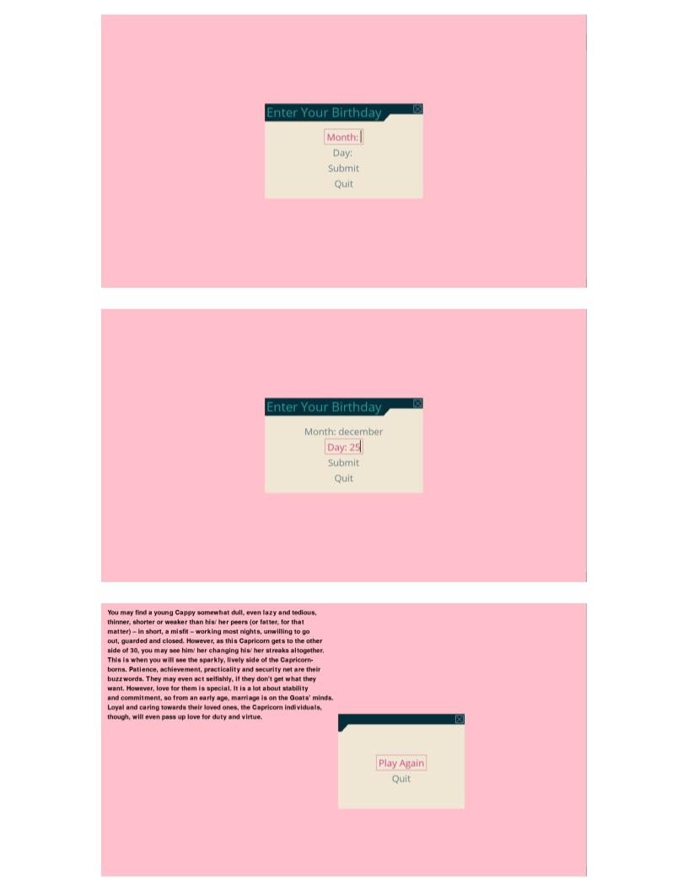

# Daily Horoscope
## CS110 Final Project - Fall 2023

## Team Members

Katarzyna Mazur, Anne Peng

***

## Project Description

This program shows the user their horoscope for the current day based on their birthdate and zodiac sign.

***    

## GUI Design

### Initial Design

### Final Design

## Program Design

### Features
1. Some input method for the user's birthday
2. Calculation to determine the user's zodiac sign
3. Requests to a horoscope API
4. Displays the user's fortune for the day
5. Play again button

### Classes

1. User class - Determines the user's zodiac sign based on the user's birthday
2. Proxy class - Sends and receives the API request for the horoscope
3. Controller class - Displays the screen to the user, manages the states of the program, takes the user's input and sends it to the User class, receives the user's zodiac sign from the User class, sends the user's zodiac sign to the Proxy class, receives the user's horoscope for the day from the Proxy class, displays the horoscope to the user

## ATP

## External Resources

1. pygame-menu - Used to create the buttons that change the states in the Controller class https://pygame-menu.readthedocs.io/en/latest/
2. Horoscope Astrology API - https://rapidapi.com/Alejandro99aru/api/horoscope-astrology
3. Program to display Astrological sign or Zodiac sign for given date of birth - Used in the find_zodiac_sign() method in the User class to determine the user's zodiac based on a range of dates https://www.geeksforgeeks.org/program-display-astrological-sign-zodiac-sign-given-date-birth/

## Additional Comments

Our original idea was to display a daily horoscope to the user based on their zodiac sign. In other words, the user would input their birthday, the program would calculate their zodiac sign and send a request to the API for a horoscope for that day. But the API for the daily horoscope keeps showing the same text no matter what the zodiac sign is and no matter the day. This is mentioned in a [discussion of the API from about 3 months ago](https://rapidapi.com/Alejandro99aru/api/horoscope-astrology/discussions/102243). As a result, we had to change the information displayed to the user.